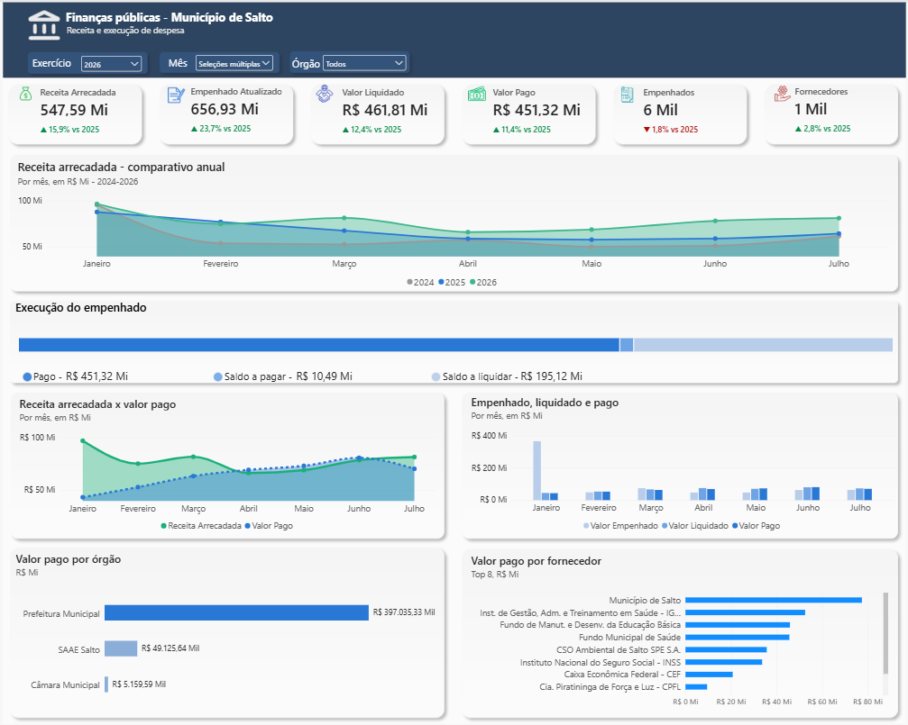
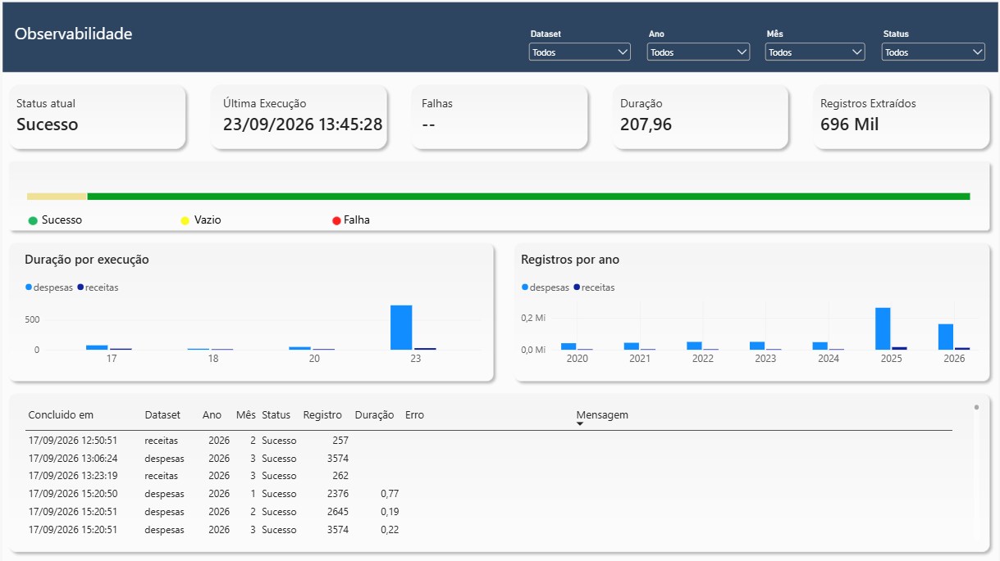
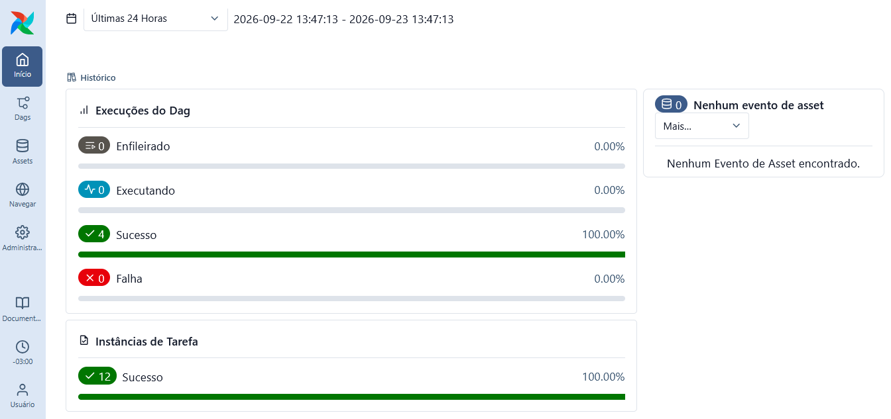

# Gastos Públicos Municipais

Projeto de engenharia de dados para ingestão, transformação, orquestração, observabilidade e análise de receitas e despesas municipais disponibilizadas pela API de Transparência do Tribunal de Contas do Estado de São Paulo (TCE-SP).

O município de Salto/SP é utilizado como escopo inicial. O projeto foi desenvolvido para aprendizado e contribuição, aplicando práticas de engenharia de dados, arquitetura em medalhões, modelagem dimensional, testes automatizados, observabilidade e visualização no Power BI.

## Objetivos

- Construir um pipeline de dados completo, reproduzível e auditável.
- Aplicar arquitetura em medalhões com camadas Bronze, Silver e Gold.
- Implementar carga histórica e atualização recorrente.
- Preservar snapshots brutos e rastreabilidade técnica.
- Aplicar testes automatizados, contratos e reconciliações financeiras.
- Orquestrar ingestão, transformação e exportação com Apache Airflow.
- Disponibilizar um modelo dimensional para consumo no Power BI.
- Monitorar requisições à API e execuções completas do pipeline.
- Manter uma estrutura preparada para expansão a outros municípios.

## Arquitetura implementada

```text
API de Transparência do TCE-SP
                |
                v
Bronze - JSON bruto e imutável
                |
                v
Silver - limpeza, tipagem e rastreabilidade
                |
                v
Gold - modelo dimensional
                |
                v
DuckDB de consumo
                |
                v
Power BI - análise e monitoramento
```

O Apache Airflow orquestra o fluxo de ponta a ponta:

```text
atualizar_bronze
        |
        v
transformar_e_testar
        |
        v
exportar_power_bi
```

DuckDB, DuckLake e dbt formam a camada de processamento e armazenamento analítico. O banco de consumo reúne tabelas de negócio no schema `gold` e tabelas operacionais no schema `ops`.

## Status atual

O pipeline completo está implementado e validado para o município de Salto/SP:

- ingestão histórica e recorrente da API do TCE-SP;
- camada Bronze com snapshots imutáveis;
- camadas Silver e Gold materializadas com dbt e DuckLake;
- modelo dimensional com oito dimensões e duas tabelas fato;
- orquestração com Apache Airflow e Docker Compose;
- exportação atômica para um arquivo DuckDB de consumo;
- dashboards analíticos e operacionais no Power BI;
- observabilidade de requisições e execuções completas;
- suíte automatizada de testes locais, dbt e Airflow.

### Camada Bronze

Principais recursos:

- ingestão mensal de despesas e receitas;
- particionamento por dataset, município, exercício e mês;
- snapshots JSON imutáveis com timestamp UTC;
- escrita atômica com arquivo temporário;
- preservação de respostas vazias válidas;
- manifesto JSON Lines com status, quantidade de registros, tamanho, hash SHA-256, horários, caminho e erros;
- retry com backoff exponencial;
- suporte ao cabeçalho HTTP `Retry-After`;
- CLI para extrações mensais;
- backfill histórico;
- atualização recorrente do exercício anterior e do exercício corrente;
- modo `dry-run`;
- continuidade do lote após falhas individuais.

O backfill inicial compreendeu janeiro de 2020 a setembro de 2026. Reexecuções posteriores criam novos snapshots sem sobrescrever versões anteriores. A Silver utiliza apenas o snapshot mais recente de cada partição mensal.

### Camada Silver

A Silver utiliza dbt Core, DuckDB e DuckLake para selecionar, limpar, tipar e materializar os dados da Bronze.

Modelos:

- `stg_despesas`;
- `stg_receitas`.

Transformações principais:

- seleção do snapshot mais recente de cada partição;
- conversão do mês textual para número inteiro;
- conversão de datas de `DD/MM/AAAA` para `DATE`;
- conversão de valores monetários para `DECIMAL(18,2)`;
- normalização de strings vazias de subalínea para `NULL`;
- preservação de `arquivo_origem` para auditoria técnica;
- preservação de valores positivos, negativos e iguais a zero;
- validação de consistência entre partição e conteúdo.

A Silver preserva todas as ocorrências da fonte. As receitas podem conter registros com atributos idênticos, mas a API não fornece chave transacional nem data de arrecadação suficiente para distinguir duplicidades técnicas de lançamentos legítimos.

Tabelas:

```text
gastos_publicos.silver.stg_despesas
gastos_publicos.silver.stg_receitas
```

### Camada Gold

A Gold contém um modelo dimensional voltado ao consumo analítico. Metadados físicos, como o caminho do arquivo Bronze, permanecem na Silver e não são expostos nas tabelas fato.

Dimensões:

- `dim_municipio`;
- `dim_orgao`;
- `dim_tempo`;
- `dim_fornecedor`;
- `dim_fonte_recurso`;
- `dim_aplicacao`;
- `dim_alinea`;
- `dim_subalinea`.

Tabelas fato:

- `fct_despesas`;
- `fct_receitas`.

Volumes de referência da última validação documentada:

- 300.149 eventos de despesas;
- 14.354 ocorrências de receitas;
- 6.063 fornecedores dimensionais;
- 81 períodos mensais;
- 5 fontes de recurso;
- 60 aplicações fixas;
- 110 alíneas;
- 148 membros de subalínea.

A dimensão de tempo mantém um calendário mensal contínuo entre janeiro de 2020 e setembro de 2026. A dimensão de subalínea inclui o membro especial `Não informada` para registros sem esse detalhamento.

Pessoas físicas utilizam uma chave de negócio composta por identificador e nome para evitar que indivíduos diferentes sejam agrupados por um código reutilizado pela fonte. Para os demais tipos, a chave deriva do identificador original.

A fato de receitas preserva todas as ocorrências. Uma impressão digital identifica o conteúdo, enquanto um número de ocorrência distingue linhas idênticas sem afirmar que se trata de uma chave oficial da API.

Tabelas:

```text
gastos_publicos.gold.fct_despesas
gastos_publicos.gold.fct_receitas
```

## Fonte e escopo dos dados

Fonte: API de Transparência do TCE-SP.

URL base:

```text
https://transparencia.tce.sp.gov.br/api/json
```

Endpoints utilizados:

```text
/municipios
/despesas/{municipio}/{exercicio}/{mes}
/receitas/{municipio}/{exercicio}/{mes}
```

Escopo atual:

- município: Salto/SP;
- identificador da API: `salto`;
- período histórico: janeiro de 2020 até o exercício corrente;
- datasets: despesas e receitas municipais;
- granularidade da extração: mensal.

A API exige uma requisição para cada combinação de dataset, município, exercício e mês.

## Dados de despesas

Campos da fonte:

- `orgao`;
- `mes`;
- `evento`;
- `nr_empenho`;
- `id_fornecedor`;
- `nm_fornecedor`;
- `dt_emissao_despesa`;
- `vl_despesa`.

Eventos observados:

- `Anulação`;
- `Empenhado`;
- `Reforço`;
- `Valor Liquidado`;
- `Valor Pago`.

Os valores não devem ser somados indiscriminadamente entre eventos, pois representam estágios e ajustes distintos da execução da despesa.

## Dados de receitas

Campos da fonte:

- `orgao`;
- `mes`;
- `ds_fonte_recurso`;
- `ds_cd_aplicacao_fixo`;
- `ds_alinea`;
- `ds_subalinea`;
- `vl_arrecadacao`.

## Stack técnica

- Python 3.12;
- HTTPX;
- PyYAML;
- pytest;
- DuckDB;
- DuckLake;
- dbt Core;
- dbt-duckdb;
- Apache Airflow 3.3.2;
- PostgreSQL 16;
- Docker Desktop;
- Docker Compose;
- Power BI Desktop;
- DuckDB ODBC e conector Power Query;
- Git e GitHub;
- Windows com WSL2 e Ubuntu 24.04 LTS.

## Estrutura do projeto

```text
gastos-publicos-salto/
├── airflow/
│   ├── dags/
│   ├── logs/
│   └── plugins/
├── config/
│   ├── data_contracts/
│   └── ingestion.yml
├── docker/
│   └── airflow/
├── docs/
│   ├── adr/
│   └── images/
├── scripts/
│   ├── dbt.sh
│   ├── run_pipeline.sh
│   └── test_all.sh
├── src/
│   ├── ingestion/
│   ├── lakehouse/
│   ├── observability/
│   └── serving/
├── tests/
│   ├── airflow/
│   ├── observability/
│   └── serving/
├── transform/
│   └── dbt_gastos_publicos/
├── .dockerignore
├── .gitignore
├── compose.yml
├── pyproject.toml
├── requirements.txt
└── README.md
```

O diretório `data/` é criado localmente, não é versionado e contém Bronze, metadados, DuckLake e o banco de consumo do Power BI.

## Organização da Bronze

```text
data/bronze/tce_sp/{dataset}/municipio={municipio}/exercicio={ano}/mes={mes}/
```

Exemplo:

```text
data/bronze/tce_sp/despesas/municipio=salto/exercicio=2026/mes=01/
```

Os nomes dos arquivos incluem dataset, município, exercício, mês e timestamp UTC. Novas execuções criam novos snapshots sem sobrescrever arquivos existentes.

## Manifestos operacionais

### Ingestão

Cada tentativa de extração é registrada em:

```text
data/metadata/ingestion_manifest.jsonl
```

Status possíveis:

- `success`: resposta válida com registros;
- `empty`: resposta válida sem registros;
- `failed`: falha de extração ou gravação.

### Pipeline

Cada execução completa da DAG é registrada em:

```text
data/metadata/pipeline_runs.jsonl
```

O registro contém origem da execução, status, indicador de `dry-run`, horários, duração, etapa com falha e mensagem de erro.

## Estratégia de atualização

A estratégia varia por camada:

### Bronze

- ingestão incremental;
- snapshots imutáveis;
- atualização recorrente dos períodos configurados;
- preservação do histórico físico.

### Silver e Gold

- reconstrução integral e idempotente;
- seleção dos snapshots mais recentes;
- execução de todos os testes e reconciliações.

A reconstrução completa foi escolhida porque o volume atual permite processar todo o histórico em poucos segundos, reduzindo complexidade operacional e riscos de inconsistência. A decisão está documentada em:

```text
docs/adr/0001-estrategia-incremental.md
```

## Modelagem dimensional

### Dimensões conformadas

- `dim_municipio`: município compartilhado pelas fatos;
- `dim_orgao`: órgãos de despesas e receitas;
- `dim_tempo`: calendário mensal contínuo;
- `dim_fornecedor`: fornecedores das despesas;
- `dim_fonte_recurso`: fontes das receitas;
- `dim_aplicacao`: aplicações fixas;
- `dim_alinea`: alíneas de receita;
- `dim_subalinea`: subalíneas, incluindo `Não informada`.

### Granularidade das fatos

`fct_despesas` possui uma linha por evento financeiro associado a um empenho.

`fct_receitas` possui uma linha por ocorrência disponibilizada pela API.

### Chaves

- `tempo_sk`: chave numérica `AAAAMM`;
- demais dimensões: hashes determinísticos derivados das chaves de negócio;
- relacionamentos no Power BI: dimensão no lado `1`, fato no lado `*`, com filtro unidirecional.

## Qualidade e testes

Comando oficial:

```bash
./scripts/test_all.sh
```

A validação consolidada executa:

- 52 testes Python locais;
- 12 modelos dbt;
- 107 testes dbt;
- 119 recursos aprovados no `dbt build`;
- validação do Docker Compose;
- 4 testes estruturais da DAG.

Os testes cobrem ingestão, retry, escrita atômica, planejamento, contratos, integridade referencial, valores aceitos, reconciliação Silver-Gold, exportação atômica, observabilidade e estrutura da DAG.

Os testes locais devem ser executados com:

```bash
pytest -q --ignore=tests/airflow
```

Os testes da DAG são executados dentro da imagem Docker do Airflow pelo script unificado.

O perfil dbt utiliza `threads: 1`, pois materializações concorrentes apresentaram conflitos no DuckLake.

## Orquestração com Apache Airflow

A infraestrutura local utiliza:

- API Server;
- Scheduler com LocalExecutor;
- DAG Processor;
- PostgreSQL para metadados;
- imagem customizada com as dependências do pipeline.

### Serviços

```text
postgres
airflow-init
airflow-api-server
airflow-scheduler
airflow-dag-processor
```

### DAG

```text
gastos_publicos_salto
```

Fluxo:

```text
atualizar_bronze
        |
        v
transformar_e_testar
        |
        v
exportar_power_bi
```

A DAG utiliza:

- agendamento às segundas-feiras, às 10:00, no fuso `America/Sao_Paulo`;
- `catchup=False`;
- `max_active_runs=1`;
- duas novas tentativas por tarefa;
- intervalo de cinco minutos entre tentativas;
- callbacks de sucesso e falha;
- logs Python sem buffer;
- segredos compartilhados para autenticação interna.

### Execução em dry-run

```bash
docker compose exec airflow-scheduler   airflow dags trigger gastos_publicos_salto   --conf '{"dry_run": true}'
```

## Exportação para Power BI

Após a validação do dbt, o pipeline gera atomicamente:

```text
data/bi/gastos_publicos.duckdb
```

Schemas exportados:

```text
gold
ops
```

O schema `gold` contém as oito dimensões e as duas fatos. O schema `ops` contém:

- `ingestion_runs`: uma linha por tentativa de extração da API;
- `pipeline_runs`: uma linha por execução completa da DAG.

A versão anterior do arquivo é preservada caso a nova exportação falhe. No Power BI Desktop, é necessário clicar em **Atualizar** após a conclusão do pipeline.

## Observabilidade

A observabilidade combina:

- manifesto de ingestão da Bronze;
- manifesto de execuções completas;
- logs por tarefa no Airflow;
- histórico de DAG Runs;
- retentativas e timeouts;
- callbacks de sucesso e falha;
- testes dbt e reconciliações;
- exportação de tabelas operacionais para o Power BI.

A página de monitoramento acompanha, entre outros indicadores:

- última extração;
- status das chamadas à API;
- respostas vazias e falhas;
- registros processados;
- duração média das extrações;
- última execução completa do pipeline;
- execução real ou `dry-run`;
- duração e status da DAG;
- etapa que falhou.

## Demonstração

### Visão Executiva

A página executiva consolida receitas, despesas, saldos, evolução mensal, órgãos e fornecedores.



### Monitoramento do Pipeline

A página operacional acompanha as requisições à API e as execuções completas do pipeline.



### Orquestração no Airflow

O Airflow coordena ingestão, transformação, testes e exportação para o Power BI.



## Decisões técnicas

- snapshots Bronze imutáveis;
- escrita atômica;
- particionamento mensal alinhado à API;
- extrações sequenciais para reduzir pressão sobre a fonte pública;
- manifesto em JSON Lines para escrita incremental;
- hash SHA-256 para integridade;
- configuração externa em YAML;
- testes HTTP sem acesso real à rede;
- reconstrução integral da Silver e da Gold no volume atual;
- `threads: 1` no dbt para estabilidade do DuckLake;
- metadados físicos mantidos na Silver e removidos das fatos Gold;
- banco DuckDB independente para consumo no Power BI;
- separação entre schemas de negócio (`gold`) e operação (`ops`).

## Controle de versão

O repositório versiona código, testes, configurações, DAGs, documentação e imagens.

Não são versionados:

- `.venv`;
- dados extraídos;
- catálogo DuckLake;
- banco de consumo do Power BI;
- logs do Airflow;
- metadados locais;
- caches;
- arquivos temporários;
- segredos do `.env`.

## Evoluções futuras

- incluir outros municípios do Estado de São Paulo;
- permitir listas configuráveis de municípios;
- publicar o relatório no Power BI Service;
- configurar atualização automática por gateway;
- adicionar notificações externas de falha;
- implementar CI/CD com GitHub Actions;
- reavaliar materializações incrementais quando o volume justificar;
- explorar enriquecimentos analíticos com modelos de inteligência artificial.

## Finalidade

Este projeto tem finalidade educacional e de portfólio. Ele demonstra conhecimentos práticos em:

- ingestão e integração com APIs;
- programação em Python;
- arquitetura em medalhões;
- armazenamento com DuckDB e DuckLake;
- transformação e testes com dbt;
- modelagem dimensional;
- resiliência e rastreabilidade;
- orquestração com Airflow;
- conteinerização com Docker;
- observabilidade;
- visualização com Power BI;
- versionamento e documentação técnica.
